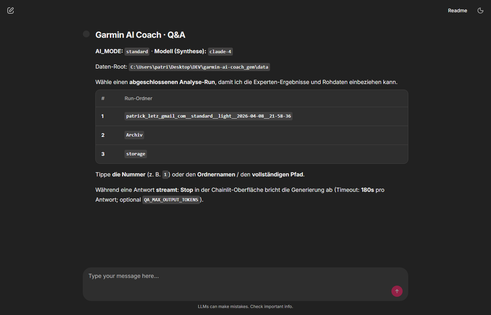
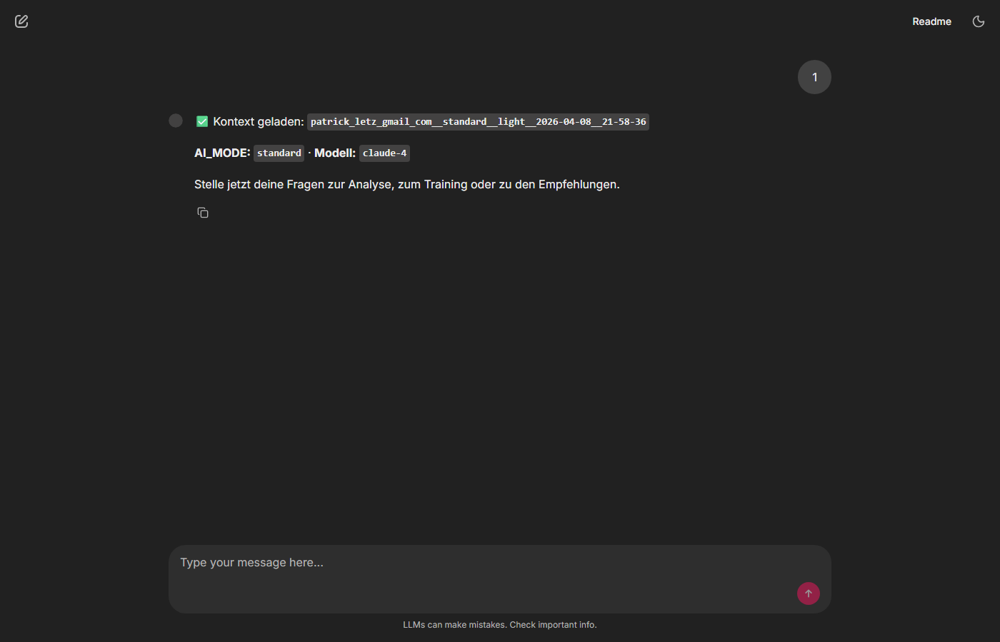
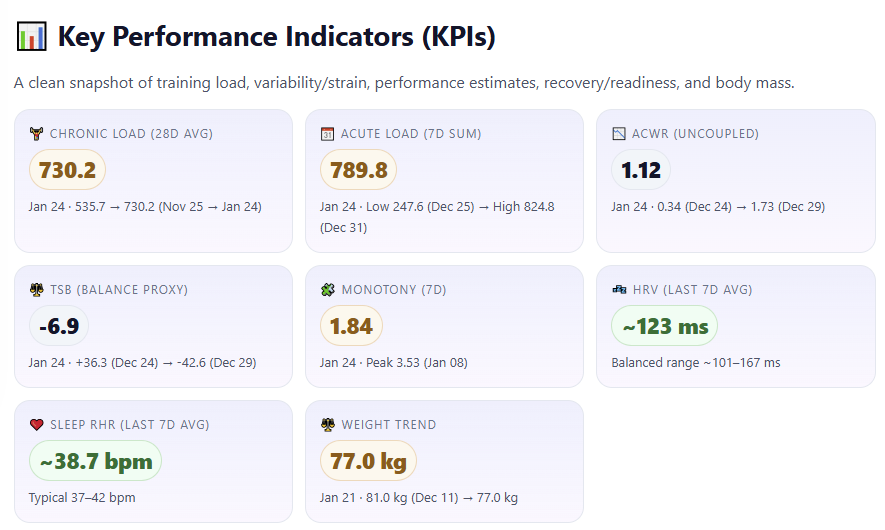
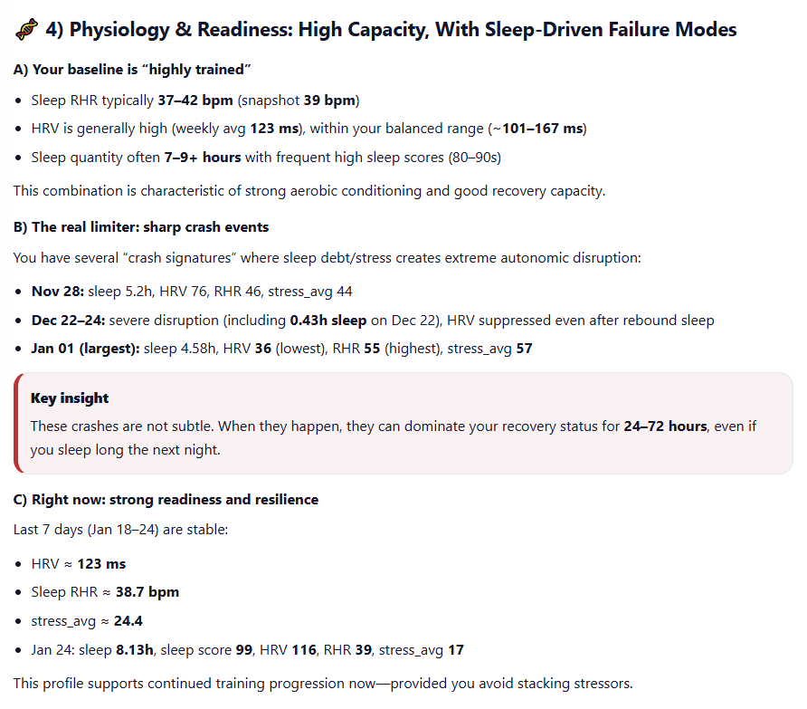
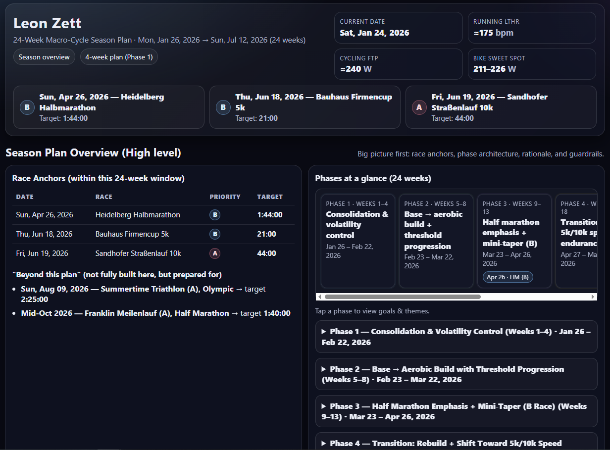
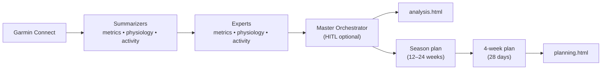

# garmin-ai-coach — 🏊‍♂️🚴‍♂️🏃‍♂️ Your AI Endurance Coach

> CLI-first tool that turns Garmin Connect data into:
>
> - an evidence-based training analysis report (`analysis.html`)
> - a season strategy + compact 4-week plan (`planning.html`)
> - **(this fork)** **Coach Chat** — *talk to your training data*: a browser Q&A on each saved run, grounded in your artifacts
>
> Powered by a LangGraph multi-agent workflow with optional human-in-the-loop (HITL) questions.

[](https://python.org)
[](https://langchain-ai.github.io/langgraph/)
[](https://github.com/Chainlit/chainlit)
[](LICENSE)

**Providers:** direct **Google (Gemini)**, **Anthropic**, **OpenAI**, plus **OpenRouter** (e.g. as a fallback router).

> Not affiliated with Garmin. Not medical advice.

---

## Coach Chat — *talk to your training data*

**Natural-language follow-ups on every analysis** — the same insights you just generated, now in a conversation. After a CLI run, everything lives in a **timestamped folder** under `./data/` (expert JSON, `garmin_data.json`, HTML). Open **Coach Chat** to challenge a recommendation, explore alternatives (e.g. intervals vs. zone 2), or go deeper on evidence — **without re-running extraction**.

```bash
pixi run qa-chat
```

- **Same `extraction.ai_mode` and API keys** as the main pipeline (reads `coach_config.yaml` by default).
- **Grounded answers** from the run you select (experts + optional raw extract + report snippets).
- **Streaming replies**, **Stop** in the UI, and **server-side timeouts / token caps** — details in [`cli/README.md`](cli/README.md#post-run-qa-chainlit).

*Tip: after your first successful run, open Coach Chat once — it’s the fastest way to stress-test whether the analysis matches how you actually train.*

---

## About this fork

This repo keeps the same **CLI-first, LangGraph multi-agent** design as upstream, with a few practical differences:

| Focus | What’s different here |
|--------|----------------------|
| **Coach Chat** (*talk to your training data*) | **Browser Q&A** (`pixi run qa-chat`) on a finished run — same model tier as the pipeline, conversation grounded in saved artifacts. See section above and [`cli/qa_chainlit_app.py`](cli/qa_chainlit_app.py). |
| **Language (German)** | **System prompts, agent instructions, and the written reports** (`analysis.html`, `planning.html`, HITL console text in German) target **German** output. Upstream is largely English-oriented; your `context.*` fields in YAML can still be written in any language, but the **default coaching voice** is German. |
| **Models** | Tiered **`extraction.ai_mode`** from cheap/fast to stronger/pricier: `development` (Gemini Flash) → `cost_effective` (Haiku) → `standard` (Claude 4) → `gemini_pro` → `openai` (`gpt-4o`). Each tier uses **direct provider APIs** where possible, with optional OpenRouter fallback — see [`services/ai/ai_settings.py`](services/ai/ai_settings.py). |
| **`run_type`** | `full` = full pipeline (**analysis + planning**, `analysis.html` + `planning.html`). `light` = **analysis only** (`analysis.html`); the entire **planning branch** is skipped (faster/cheaper). Set `extraction.run_type` in YAML; the CLI exports `RUN_TYPE` the same way it does `AI_MODE`. |

**Other tweaks vs. upstream:** **per-run output folders** (`<email>__<ai_mode>__<run_type>__<date>__<time>/`), **clearer cost reporting** (`total_cost_usd` may be `null` with `cost_calculable`), **more resilient graphs** when expert JSON is missing (placeholders instead of hard failure). Put secrets (**API keys, Garmin password**) in **`.env`**; run parameters in **`coach_config.yaml`** — see [`cli/README.md`](cli/README.md).

---

## 🚀 Quick Start (Pixi)

```bash
# 1) Install dependencies
pixi install

# 2) Create your configuration
pixi run coach-init my_training_config.yaml

# 3) Edit the config with your details, then run
pixi run coach-cli --config my_training_config.yaml

# 4) Coach Chat — talk to your training data (follow-ups in the browser)
pixi run qa-chat
```

Open the generated reports:

- `./data/<run-folder>/analysis.html`
- `./data/<run-folder>/planning.html`

Then launch **`pixi run qa-chat`**, pick that run folder, and keep the conversation going in the browser.

---

## ✨ What You Get

- **Coach Chat** — *talk to your training data*: conversational follow-ups on the same run, grounded in expert outputs + `garmin_data.json` (see [`cli/README.md`](cli/README.md#post-run-qa-chainlit))
- KPI dashboard: chronic/acute load, ACWR, HRV, sleep RHR, weight trend
- Running execution analysis: progression evidence + coaching insights
- Physiology & readiness: baseline profiling + crash signature detection
- Actionable recommendations grouped by domain (load, running, cycling, recovery)
- Season strategy (typically 12–24 weeks) + compact 4-week plan (28 days)
- Optional: HITL questions (`hitl_enabled: true`)
- Optional: competition import from Outside (BikeReg/RunReg/TriReg/SkiReg)
- Optional: LangSmith tracing + cost tracking (`LANGSMITH_API_KEY`)

---

## 🎯 See It In Action

### 💬 Coach Chat


*Willkommen: Runs unter `data/` als Tabelle; Nummer, Ordnername oder Pfad eingeben.*


*Nach der Auswahl: Bestätigung mit Run-Ordner und Hinweis auf Fragen (ohne LLM-Aufruf für diesen Schritt).*

### 📊 Analysis Reports


*Key Performance Indicators: training load, ACWR, HRV, recovery metrics, and body composition at a glance*


*Deep physiological analysis: baseline profiling, crash signature detection, and current readiness assessment*

### 📅 Training Plans


*Macro-cycle season plan with race anchors, phase architecture, and periodization timeline*

---

## 🧠 How It Works (High Level)



Docs:

- CLI usage: [`cli/README.md`](cli/README.md)
- Full architecture diagram: [`agents_docs/langgraph_architecture_diagram.mmd`](agents_docs/langgraph_architecture_diagram.mmd)
- Tech stack & internals: [`agents_docs/techStack.md`](agents_docs/techStack.md)

---

## 📋 Configuration (YAML/JSON)

Start from the template:

- `pixi run coach-init my_training_config.yaml`
- or copy [`coach_config.yaml`](coach_config.yaml) / [`cli/coach_config.yaml`](cli/coach_config.yaml) as a starting point

Minimal example:

```yaml
athlete:
  name: "Your Name"
  email: "you@example.com"

context:
  analysis: "Recovering from injury; focus on base building"
  planning: "Half marathon in 12 weeks; build aerobic base"

extraction:
  activities_days: 21
  metrics_days: 56
  ai_mode: "standard"       # development … openai (see “About this fork” / coach_config.yaml)
  run_type: "full"          # full | light — light = analysis.html only
  enable_plotting: false
  hitl_enabled: true
  skip_synthesis: false

competitions:
  - name: "Target Race"
    date: "2026-04-15"
    race_type: "Half Marathon"
    priority: "A"
    target_time: "01:40:00"

# Optional: auto-import competitions from Outside (BikeReg/RunReg/TriReg/SkiReg)
outside:
  bikereg:
    - id: 71252
      priority: "B"

output:
  directory: "./data"

logging:
  level: INFO

# Optional YAML fallback — prefer GARMIN_EMAIL / GARMIN_PASSWORD in .env (see cli/README.md)
credentials:
  password: ""
```

---

## 📦 Outputs

Generated files in `output.directory` (default: `./data`):

Each run writes into a **new subfolder** under `output.directory`:

- `<email>__<ai_mode>__<run_type>__<YYYY-MM-DD>__<HH-MM-SS>/`

Inside that run folder:

- `analysis.html` — training analysis report
- `planning.html` — season overview + compact 4-week plan
- `metrics_expert.json`, `activity_expert.json`, `physiology_expert.json` — structured expert outputs
- `garmin_data.json` — extracted Garmin payload for this run (also used by **Coach Chat**)
- `season_plan.md`, `weekly_plan.md` — intermediate planning artifacts
- `summary.json` — metadata including `run_type`; cost fields when available; `cost_calculable`

---

## 🎛️ Providers & Model Selection

Set at least one provider API key (e.g. in `.env`):

- `OPENAI_API_KEY`
- `ANTHROPIC_API_KEY`
- `OPENROUTER_API_KEY` (DeepSeek/Gemini/Grok, and can also act as a fallback router)
- `GOOGLE_API_KEY` (for direct Gemini usage via Google’s API)

`ai_mode` and `run_type` are read from **`extraction.ai_mode`** and **`extraction.run_type`** in YAML (the coach-cli sets `AI_MODE` and `RUN_TYPE` before `reload_config()`). You don’t need those env vars in `.env` for normal CLI runs; use them only for non-CLI entrypoints (defaults: `standard` + `full`). **Legacy:** the value `pro` is treated as **`gemini_pro`**.

Defaults (role→model mapping) live in:

- [`services/ai/ai_settings.py`](services/ai/ai_settings.py)
- [`services/ai/model_config.py`](services/ai/model_config.py)

Optional:

- `LANGSMITH_API_KEY` enables LangSmith tracing / cost tracking.

---

## 🔒 Privacy / Data Handling

- No first-party backend: the CLI runs locally and writes outputs to your machine.
- Your Garmin-derived data is sent to your configured LLM provider to generate the reports.
- If `LANGSMITH_API_KEY` is set, workflow traces (including prompt/response content) are sent to LangSmith.

---

<details>
<summary>Advanced: Installation without Pixi</summary>

```bash
# Pixi is the recommended setup for this fork.
# This pip-based path is provided for compatibility and may require manual troubleshooting.
pip install -r requirements.txt
python cli/garmin_ai_coach_cli.py --init-config my_training_config.yaml
python cli/garmin_ai_coach_cli.py --config my_training_config.yaml
```

</details>

<details>
<summary>Advanced: Development</summary>

```bash
pixi run lint-ruff
pixi run ruff-fix
pixi run format
pixi run type-check
pixi run test
pixi run dead-code
```

Project structure:

```text
garmin-ai-coach/
├── core/                     # Configuration
├── services/
│   ├── garmin/               # Garmin Connect extraction
│   ├── ai/langgraph/         # LangGraph workflows + nodes
│   ├── ai/tools/plotting/    # Optional plotting tools
│   └── outside/              # Outside (BikeReg/RunReg/...) competitions
├── cli/                      # CLI entrypoint + config template
├── agents_docs/              # Internal docs (architecture/stack)
└── tests/
```

</details>

---

## 🤝 Contributing

PRs welcome. If you’re adding features, please keep the CLI-first workflow intact and add tests where it makes sense.

---

## 📄 License

MIT License — see [LICENSE](LICENSE) for details.
