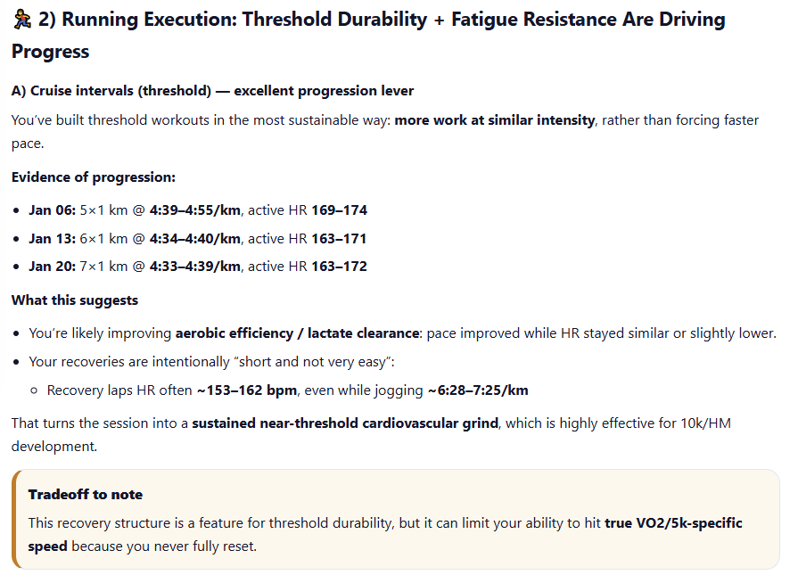
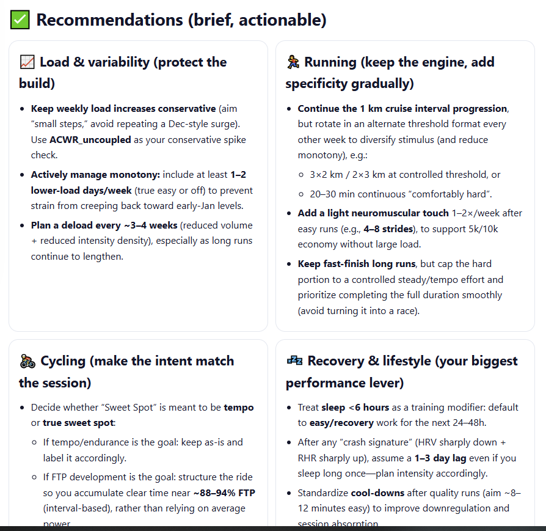
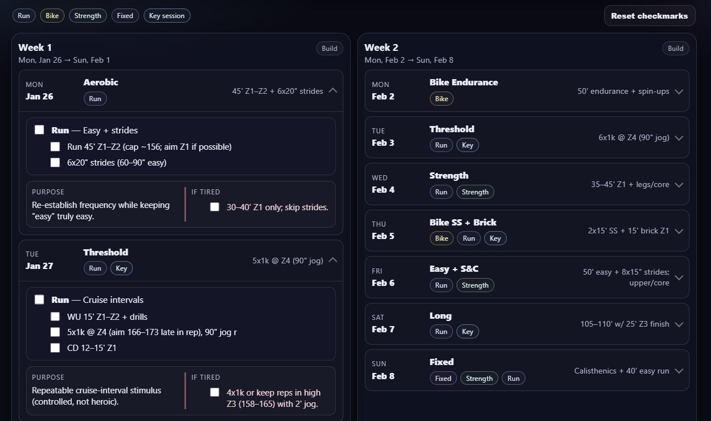
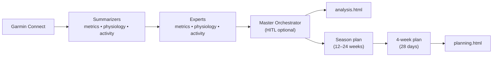

# garmin-ai-coach — 🏊‍♂️🚴‍♂️🏃‍♂️ Your AI Endurance Coach

> CLI-first tool that turns Garmin Connect data into:
>
> - an evidence-based training analysis report (`analysis.html`)
> - a season strategy + compact 4-week plan (`planning.html`)
>
> Powered by a LangGraph multi-agent workflow with optional human-in-the-loop (HITL) questions.

[](https://python.org)
[](https://langchain-ai.github.io/langgraph/)
[](LICENSE)

**Providers:** OpenAI, Anthropic, and OpenRouter (DeepSeek/Gemini/Grok via OpenRouter).

> Not affiliated with Garmin. Not medical advice.

---

## 🚀 Quick Start (Pixi)

```bash
# 1) Install dependencies
pixi install

# 2) Create your configuration
pixi run coach-init my_training_config.yaml

# 3) Edit the config with your details, then run
pixi run coach-cli --config my_training_config.yaml
```

Open the generated reports:

- `./data/analysis.html`
- `./data/planning.html`

---

## ✨ What You Get

- KPI dashboard: chronic/acute load, ACWR, HRV, sleep RHR, weight trend
- Running execution analysis: progression evidence + coaching insights
- Physiology & readiness: baseline profiling + crash signature detection
- Actionable recommendations grouped by domain (load, running, cycling, recovery)
- Season strategy (typically 12–24 weeks) + compact 4-week plan (28 days)
- Optional: HITL questions (`hitl_enabled: true`)
- Optional: competition import from Outside (BikeReg/RunReg/TriReg/SkiReg)
- Optional: LangSmith tracing + cost tracking (`LANGSMITH_API_KEY`)

---

## 🎯 See It In Action

### 📊 Analysis Reports


*Key Performance Indicators: training load, ACWR, HRV, recovery metrics, and body composition at a glance*


*Evidence-based progression tracking with threshold durability insights and coaching notes*


*Deep physiological analysis: baseline profiling, crash signature detection, and current readiness assessment*


*Sport-specific recommendations organized by category: load management, running, cycling, and recovery*

### 📅 Training Plans


*Macro-cycle season plan with race anchors, phase architecture, and periodization timeline*


*Structured day plan with intensity zones, adaptations, and monitoring cues*

---

## 🧠 How It Works (High Level)



Docs:

- CLI usage: [`cli/README.md`](cli/README.md)
- Full architecture diagram: [`agents_docs/langgraph_architecture_diagram.mmd`](agents_docs/langgraph_architecture_diagram.mmd)
- Tech stack & internals: [`agents_docs/techStack.md`](agents_docs/techStack.md)

---

## 📋 Configuration (YAML/JSON)

Start from the template:

- `pixi run coach-init my_training_config.yaml`
- or copy [`cli/coach_config_template.yaml`](cli/coach_config_template.yaml)

Minimal example:

```yaml
athlete:
  name: "Your Name"
  email: "you@example.com"

context:
  analysis: "Recovering from injury; focus on base building"
  planning: "Half marathon in 12 weeks; build aerobic base"

extraction:
  activities_days: 21
  metrics_days: 56
  ai_mode: "standard"          # development | standard | cost_effective | pro
  enable_plotting: false
  hitl_enabled: true
  skip_synthesis: false

competitions:
  - name: "Target Race"
    date: "2026-04-15"
    race_type: "Half Marathon"
    priority: "A"
    target_time: "01:40:00"

# Optional: auto-import competitions from Outside (BikeReg/RunReg/TriReg/SkiReg)
outside:
  bikereg:
    - id: 71252
      priority: "B"

output:
  directory: "./data"

# Optional: keep empty to be prompted securely at runtime
credentials:
  password: ""
```

---

## 📦 Outputs

Generated files in `output.directory` (default: `./data`):

- `analysis.html` — training analysis report
- `planning.html` — season overview + compact 4-week plan
- `metrics_expert.json`, `activity_expert.json`, `physiology_expert.json` — structured expert outputs
- `season_plan.md`, `weekly_plan.md` — intermediate planning artifacts
- `summary.json` — metadata + cost summary (`trace_id` / `root_run_id` when LangSmith is enabled)

---

## 🎛️ Providers & Model Selection

Set at least one provider API key (e.g. in `.env`):

- `OPENAI_API_KEY`
- `ANTHROPIC_API_KEY`
- `OPENROUTER_API_KEY` (DeepSeek/Gemini/Grok, and can also act as a fallback router)
- `GOOGLE_API_KEY` (Necessary for the direct utilization of Gemini models via google api)

The run’s `ai_mode` comes from `extraction.ai_mode` (the CLI exports it to `AI_MODE` internally).

Defaults (role→model mapping) live in:

- [`services/ai/ai_settings.py`](services/ai/ai_settings.py)
- [`services/ai/model_config.py`](services/ai/model_config.py)

Optional:

- `LANGSMITH_API_KEY` enables LangSmith tracing / cost tracking.

---

## 🔒 Privacy / Data Handling

- No first-party backend: the CLI runs locally and writes outputs to your machine.
- Your Garmin-derived data is sent to your configured LLM provider to generate the reports.
- If `LANGSMITH_API_KEY` is set, workflow traces (including prompt/response content) are sent to LangSmith.

---

<details>
<summary>Advanced: Installation without Pixi</summary>

```bash
pip install -r requirements.txt
python cli/garmin_ai_coach_cli.py --init-config my_training_config.yaml
python cli/garmin_ai_coach_cli.py --config my_training_config.yaml
```

</details>

<details>
<summary>Advanced: Development</summary>

```bash
pixi run lint-ruff
pixi run ruff-fix
pixi run format
pixi run type-check
pixi run test
pixi run dead-code
```

Project structure:

```text
garmin-ai-coach/
├── core/                     # Configuration
├── services/
│   ├── garmin/               # Garmin Connect extraction
│   ├── ai/langgraph/         # LangGraph workflows + nodes
│   ├── ai/tools/plotting/    # Optional plotting tools
│   └── outside/              # Outside (BikeReg/RunReg/...) competitions
├── cli/                      # CLI entrypoint + config template
├── agents_docs/              # Internal docs (architecture/stack)
└── tests/
```

</details>

---

## 🤝 Contributing

PRs welcome. If you’re adding features, please keep the CLI-first workflow intact and add tests where it makes sense.

---

## 📄 License

MIT License — see [LICENSE](LICENSE) for details.
